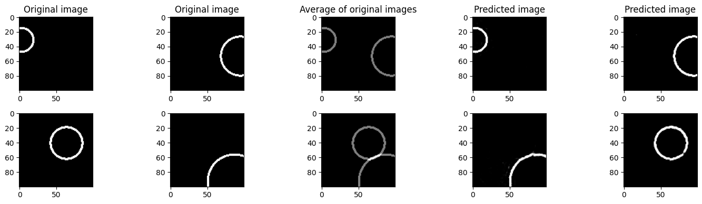

# reconstruct-images-from-average

A notebook where PyTorch is used for training a model that takes in the average of two images and predicts the two original images. The intention behind this project was just to demonstrate some basic literacy when it comes to deep learning and PyTorch, so the model was not trained until perfection and there's no claim that this approach is groundbreaking in any way.

The approach used in the notebook is general in the sense that it doesn't make any explicit assumptions about the content category of the original images. However, for many categories of images, there could be several reasonable reconstructions from the average of two images, so to clearly demonstrate how well the approach works, the notebook uses examples where there is a clearly defined answer: each original image consists of a circle where its size and position are varied across the images. See the figure below with original images, corresponding average images (i.e. the inputs to the model) and the original images reconstructed by a trained model.

Other than the PyTorch dependency, the notebook also requires matplotlib and numpy.

For more information (about e.g. the model architecture or loss function that was used), see text and code fields in the notebook.
